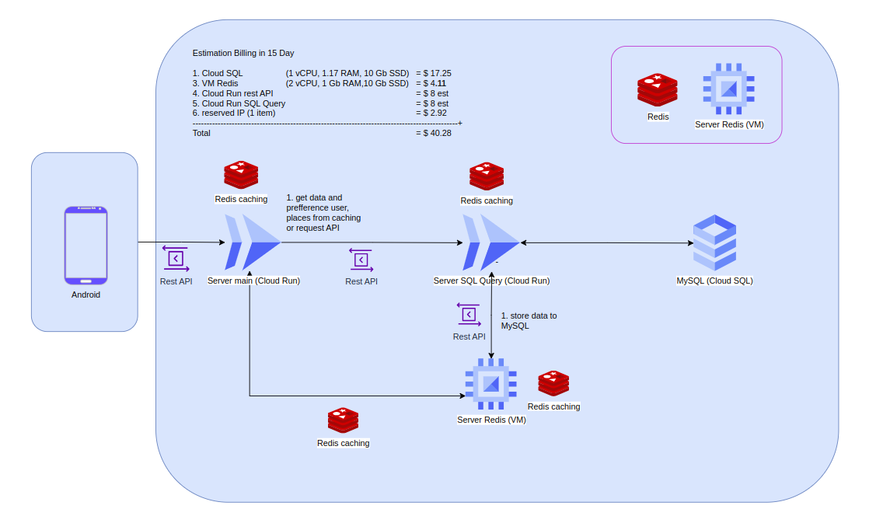

## Documentations

### Infrastructure



Our infrastructure is divided into two core servers using Cloud Run. The first server, referred to as the main server, handles authentication and serves as the gateway for communication with the Android application. The second server is the SQL server, which manages the logical API for maps and is connected to MySQL.

In addition, we have a side server set up as a virtual machine (VM) that utilizes Redis for caching purposes. This caching server helps improve performance and efficiency by storing frequently accessed data. Furthermore, we have reserved an IP address for the static endpoint in the Redis server, ensuring a consistent and reliable connection.

Overall, this infrastructure setup allows for secure authentication, efficient communication with the Android application, optimized data retrieval through caching, and seamless integration with the MySQL database.

## Documentation API

### _error_

Each response always contains error information in `error` variable. If `error` is `true` indicating an error occurred.

- response
  ```typescript
  {
    error: boolean,
    message: string
  }
  ```

<br/>

## Authentication

### _link_

```https
https://cc-main-server-oislxufxaa-et.a.run.app
```

### _register_

```http
POST /register
```

- example link request

  ```https
  https://cc-main-server-oislxufxaa-et.a.run.app/register
  ```

- body

  ```typescript
  {
    email: string,
    password: string,
    fullname: string,
  }
  ```

- response type

  ```typescript
  {
    error: boolean,
    message: string
  }
  ```

- example response

  ```typescript
  {
    error: false,
    message:"user successfully registered"
  }
  ```

### _Login_

```http
POST /login
```

- example link request

  ```https
  https://cc-main-server-oislxufxaa-et.a.run.app/login
  ```

- body

  ```typescript
  {
    email: string,
    password: string
  }
  ```

- response

  ```typescript
  {
    error: boolean,
    data:[
      {
        User_ID: string,
        FullName: string,
        Email: string,
        Password: string,
        Latitude: number,
        Longitude: number
      }
    ],
    message: string
  }
  ```

- example response

  ```typescript
  {
    "error": false,
    "data": [
        {
            "User_ID": "001",
            "FullName": "Andi Budi",
            "Email": "andibudi@gmail.com",
            "Latitude": -7.78297,
            "Longitude": 110.367,
            "Password": "andibudi123"
        }
    ],
    "message": "Login successful"
  }
  ```

### _logout_

```http
GET /logout
```

- example link request
  ```https
  https://cc-main-server-oislxufxaa-et.a.run.app/logout
  ```
- response

  ```typescript
  {
    error: boolean,
    message: string
  }
  ```

- example response
  ```typescript
  {
    "error": false,
    "message": "Logout successful!"
  }
  ```

### _logged_

```http
GET /logged
```

- example link request

  ```https
  https://cc-main-server-oislxufxaa-et.a.run.app/logged
  ```

- response
  ```typescript
  {
    error: boolean,
    message: string
  }
  ```
- example response
  ```typescript
  {
    "error": true,
    "message": "Unauthorized"
  }
  ```

## Recomendations and Maps API

### _Recommendation Places_

```http
GET /api/recomendation-place/?key=user_id
```

- example link request
  ```https
  https://cc-main-server-oislxufxaa-et.a.run.app
  /api/recomendation-place/?key=002
  ```
- parameters
  - key: user_id
- response

  ```typescript
  {
    error: boolean,
    data: [
      {
        place_id: string,
        name: string,
        Latitude: number,
        Longitude: number,
        OverallRating: number,
        UserRatingTotal: number,
        StreetAddress: string | null,
        District: string | null,
        City: string | null,
        Regency: string | null,
        Province: string | null,
        distance: number,
        distanceTime: number,
        photoReference: string
      }
    ]
  }
  ```

- example response
  ```typescript
  {
    "error": false,
    "data": [
        {
            "place_id": "ChIJ7d_nCsBZei4R4nM70A44-UE",
            "name": "Mucho Cafe & Bar",
            "Latitude": -7.77629,
            "Longitude": 110.403,
            "OverallRating": 4.6,
            "UserRatingTotal": 157,
            "StreetAddress": null,
            "District": "Kec. Depok",
            "City": null,
            "Regency": "Kabupaten Sleman",
            "Province": "Daerah Istimewa Yogyakarta",
            "distance": 1.899,
            "distanceTime": 5.7,
            "photoReference": "https://maps.googleapis.com/maps/api/place/photo?maxwidth=400&photoreference=AZose0n44irQKceF96xE-V8s_HD7WS24nu_NwcZfZjf7shHyVaulb7nMeErddF6aRA8-PUw_w29sQB3OHeo3m_zZCH8Qb8o7HOEY8J-KK0G2owqp2dbr63_lfEEFWvWHkn9xynvzz0UNMJkMDS6k_Y56TmPtL9kk-0MZYjDM_cRZC3jz5Djd&key=FILL_THIS_WITH_YOUR_MAP_API_KEY"
        },
        {
            "place_id": "ChIJa4xFOZNZei4RddSVY-39S8s",
            "name": "Goodwin Bar and Eatery",
            "Latitude": -7.7723,
            "Longitude": 110.41,
            "OverallRating": 4.5,
            "UserRatingTotal": 211,
            "StreetAddress": "Jl. Selokan Mataram No.1-3",
            "District": "Kec. Depok",
            "City": null,
            "Regency": "Kabupaten Sleman",
            "Province": "Daerah Istimewa Yogyakarta",
            "distance": 1.34,
            "distanceTime": 4.02,
            "photoReference": "https://maps.googleapis.com/maps/api/place/photo?maxwidth=400&photoreference=AZose0kVwyJeOnSISV6hS6KasHMLCbTe9cb23IcLkepI5LkR1hUkrYWL8LDe7xoIKvy7Q2D-ZuX_z3pemGd2Ux8Vn6i18zPDc-fvLnU0nIYbqPEdKMozQwcpyhyI0OO71yZ7PTZIUuu1phtYm-JWi2EDWLTYx1I17dVRXA5JrMMqkh0fi3H-&key=FILL_THIS_WITH_YOUR_MAP_API_KEY"
        },
        {
            "place_id": "ChIJQ2aVkI9Xei4RnZIJFH9yaN8",
            "name": "Pendopo Lawas",
            "Latitude": -7.80435,
            "Longitude": 110.366,
            "OverallRating": 4.4,
            "UserRatingTotal": 10024,
            "StreetAddress": "Jl. Alun-Alun Utara",
            "District": "Kecamatan Kraton",
            "City": "Kota Yogyakarta",
            "Regency": null,
            "Province": "Daerah Istimewa Yogyakarta",
            "distance": 6.822,
            "distanceTime": 20.47,
            "photoReference": "https://maps.googleapis.com/maps/api/place/photo?maxwidth=400&photoreference=AZose0m74QVzJtU287w3HDgX-6noRiDNs7mVPrrRb1uCJ4y8GR2Cn-8Cd8vuX01pPYwXYwE3Q_FT5DJadCB-aBBw5Lg9z0qy752KIXfnCt6h-HgxieRqGdDmW4DH_N2Wk2-A0EYubNCxspaszQrLr5sbg3qWCEG8bSGZYOnoLUkHAUkh_OKy&key=FILL_THIS_WITH_YOUR_MAP_API_KEY"
        },
        {
            "place_id": "ChIJKVwqYEWzey4RD5JYvOOOGgE",
            "name": "Kandang ogut's",
            "Latitude": -7.97012,
            "Longitude": 110.583,
            "OverallRating": 4.3,
            "UserRatingTotal": 542,
            "StreetAddress": null,
            "District": "Kec. Wonosari",
            "City": null,
            "Regency": "Kabupaten Gunung Kidul",
            "Province": "Daerah Istimewa Yogyakarta",
            "distance": 30.228,
            "distanceTime": 90.68,
            "photoReference": "https://maps.googleapis.com/maps/api/place/photo?maxwidth=400&photoreference=AZose0lBU8PHdvbafQQ2SH6A7mBfYF9LC--wlPiPqJ5N5yZS8KzY-6zRuIsn0-sOhWjw1UE3-pq1v1F-sY9S1RWYUeqOKNUYDhCmwOqN9HVTRsgXRffOL8h9OM3Sbpv20fVGWCQO1iHxbLAx3WPfxXDWpledUm5H_MwTZoQoArqK-j7benjZ&key=FILL_THIS_WITH_YOUR_MAP_API_KEY"
        },
        {
            "place_id": "ChIJHfSeNgNZei4RT3WiyG3HX_U",
            "name": "Barley and Barrel",
            "Latitude": -7.78275,
            "Longitude": 110.382,
            "OverallRating": 4.9,
            "UserRatingTotal": 42,
            "StreetAddress": "Jl. Urip Sumoharjo No.37",
            "District": "Kec. Gondokusuman",
            "City": "Kota Yogyakarta",
            "Regency": null,
            "Province": "Daerah Istimewa Yogyakarta",
            "distance": 3.888,
            "distanceTime": 11.66,
            "photoReference": "https://maps.googleapis.com/maps/api/place/photo?maxwidth=400&photoreference=AZose0l72vf7fthF9eK_7x6wrslNSfwDiDC5gNgdj214Z3lGt4yKdt_cHbCfeZQodH6B7YR-yPkN6XdM82uu0EbEBRcj8YVnKU4PKhIwGT-vQrIn1QwQ7v5mpOh4V-ITdHxsIe6r1IHetSVH2ml1uE-6M-9DSGeaIa4VR9C-MNVh5wqxsuRw&key=FILL_THIS_WITH_YOUR_MAP_API_KEY"
        },
        {
            "place_id": "ChIJFW9moyZYei4RyydF4VnJZgw",
            "name": "Lucifer",
            "Latitude": -7.79164,
            "Longitude": 110.362,
            "OverallRating": 4.1,
            "UserRatingTotal": 634,
            "StreetAddress": "Jl. Sosrowijayan No.71",
            "District": null,
            "City": "Kota Yogyakarta",
            "Regency": null,
            "Province": "Daerah Istimewa Yogyakarta",
            "distance": 6.249,
            "distanceTime": 18.75,
            "photoReference": "https://maps.googleapis.com/maps/api/place/photo?maxwidth=400&photoreference=AZose0mj0mYIm1sVOH-lh6xiOZLY_vnZOE8cZhfjcDowBzA2fHW8oY9Qq_4Gtlx9ZdWsP8EMFFtF6bSTlilND6qDY5W8H8MWCGuVN0mmq2wwSh3snVWvSrYBFiBAqYdMHSyVvW1nsKwQfZC7BBqjHNNEMzM4H1WYp9ObsKKoJZwvyaQrKsFG&key=FILL_THIS_WITH_YOUR_MAP_API_KEY"
        },
        {
            "place_id": "ChIJxbpgRkhYei4Ri0J5gvxo4CE",
            "name": "Eboni Bar And Lounge",
            "Latitude": -7.77367,
            "Longitude": 110.369,
            "OverallRating": 4.8,
            "UserRatingTotal": 92,
            "StreetAddress": "Jl. A.M. Sangaji No.72 A",
            "District": "Kec. Jetis",
            "City": "Kota Yogyakarta",
            "Regency": null,
            "Province": "Daerah Istimewa Yogyakarta",
            "distance": 4.656,
            "distanceTime": 13.97,
            "photoReference": "https://maps.googleapis.com/maps/api/place/photo?maxwidth=400&photoreference=AZose0nsRAyUxzYVhGII-76TQdaBH_Pfb2HodpNoHVmjVMzgRPKwPMBg29pXYKwRrU8ghKp8yb7Z6sYws4tTSBE8qGl4hqwMJqNvrjKOQBbmCnOyeDOYwZE43yoec9eDx9UWbuHzfW4VtB5JK4NO_LwYZR7RVDxnT47AIdX8hLHXazAqxTad&key=FILL_THIS_WITH_YOUR_MAP_API_KEY"
        },
        {
            "place_id": "ChIJbc2bgURYei4RAw8upAxTexE",
            "name": "Liquid Bar And Kitchen",
            "Latitude": -7.76727,
            "Longitude": 110.361,
            "OverallRating": 4.5,
            "UserRatingTotal": 5063,
            "StreetAddress": "Jl. Magelang - Yogyakarta KM.4,5 No.158",
            "District": "Kec. Mlati",
            "City": null,
            "Regency": "Kabupaten Sleman",
            "Province": "Daerah Istimewa Yogyakarta",
            "distance": 5.351,
            "distanceTime": 16.05,
            "photoReference": "https://maps.googleapis.com/maps/api/place/photo?maxwidth=400&photoreference=AZose0lruBkbe3jd7C9367HhpxBXjR6TPjNrGHAqndzsX4E93mOTXCODaq0_GYrtmZ1aYqabWc7u1aQZt3KJ1fe9GCPcm3wVQHhuGOcIIDLkexy0fqPTvAZfl09JFVy5AU0WwaRyrC1ApHpgPadS9Ha0TIvfzDVZe878zf3mQnyve4ZJZsU&key=FILL_THIS_WITH_YOUR_MAP_API_KEY"
        },
        {
            "place_id": "ChIJycBiwr5Zei4Rhd7p2_cW6Zw",
            "name": "Nyore Coffee & Space",
            "Latitude": -7.78522,
            "Longitude": 110.367,
            "OverallRating": 4.8,
            "UserRatingTotal": 163,
            "StreetAddress": "Jl. Margo Utomo No.79",
            "District": "Kec. Jetis",
            "City": "Kota Yogyakarta",
            "Regency": null,
            "Province": "Daerah Istimewa Yogyakarta",
            "distance": 5.4,
            "distanceTime": 16.2,
            "photoReference": "https://maps.googleapis.com/maps/api/place/photo?maxwidth=400&photoreference=AZose0nmiLQh07LKVOpC4MygEvSl0l8q07EYwNrpocsbnXA6ferdSL-2EWRMjKfHsHe_nC2l8ydruWaO35H82q9qHG74w8M-STGny_jBN0g78NVYFCO0BZKccyy3HXEYxu4jT4FI67S7kNszD5g119B6f6fHoO11isgZDYbYzDmHyHEZLdvV&key=FILL_THIS_WITH_YOUR_MAP_API_KEY"
        },
        {
            "place_id": "ChIJZ2c-RxK1ey4RPYqaToDztJ8",
            "name": "Angkringan iva",
            "Latitude": -7.94888,
            "Longitude": 110.653,
            "OverallRating": 4.9,
            "UserRatingTotal": 15,
            "StreetAddress": null,
            "District": "Kec. Karangmojo",
            "City": null,
            "Regency": "Kabupaten Gunung Kidul",
            "Province": "Daerah Istimewa",
            "distance": 34.127,
            "distanceTime": 102.38,
            "photoReference": "https://maps.googleapis.com/maps/api/place/photo?maxwidth=400&photoreference=AZose0lC2BV0V__mqPqguUvD86q1k7hBPIVQT4BjdxLat17Zk45159RA_BYmR1quZs-s1MVo7AU4aOMCplVeQr0MZNvVe63niqppJgIbuellhsgiP7izyCTWz6PHy3Uf6KlQ1ymqkbhaQk4y5lhoRIP63z07SDjVrnq5PWvTMGrjjGIw-w09&key=FILL_THIS_WITH_YOUR_MAP_API_KEY"
        }
    ]
  }
  ```

### _Detail Places_

```http
GET /api/detail-place/:place_id
```

- example link request

  ```https
  https://cc-main-server-oislxufxaa-et.a.run.app
  /api/detail-place/ChIJHfSeNgNZei4RT3WiyG3HX_U
  ```

- response

  ```typescript
  {
    error: boolean
    overview: [
      {
        Place_ID: string,
        Name: string,
        FormattedPhone: string | null,
        FormattedAddress: string | null,
        Latitude: number,
        Longitude: number,
        OverallRating: number,
        UserRatingTotal: number,
        StreetAddress: string | null,
        District: string | null,
        City: string | null,
        Regency: string | null,
        Province: string | null,
        PostalNumber: string | null,
        images: [ string ],
        open: string | null,
        close: string | null,
      }
    ],
    tags: [
      {
        categories: [ string ],
        services: [ string ],
      }
    ],
    reviews: [
      {
        name: string,
        star: number,
        reviewtext: string,
      }
    ]
  }
  ```

- example response
  ```typescript
  {
    "error": false,
    "overview": [
        {
            "Place_ID": "ChIJHfSeNgNZei4RT3WiyG3HX_U",
            "Name": "Barley and Barrel",
            "FormattedAddress": "Ground Floor, Jl. Urip Sumoharjo No.37, Klitren, Kec. Gondokusuman, Kota Yogyakarta, Daerah Istimewa Yogyakarta 55522",
            "StreetAddress": "Jl. Urip Sumoharjo No.37",
            "District": "Kec. Gondokusuman",
            "City": "Kota Yogyakarta",
            "Regency": null,
            "Province": "Daerah Istimewa Yogyakarta",
            "PostalNumber": "55522",
            "FormattedPhone": "(0274) 560284",
            "Latitude": -7.78275,
            "Longitude": 110.382,
            "OverallRating": 4.9,
            "UserRatingTotal": 42,
            "images": [
                "https://maps.googleapis.com/maps/api/place/photo?maxwidth=400&photoreference=AZose0kLXqAYV6R_oqDQkQcBwBpVDXLTI1k7DUpFZG3GEprjdUHY3vrJAvFl1CeXdU4GrUXi0-PV3jl8zTQ-AKrl9gEWtaRlK67oT8hRQwx1yDV1zEKq8gB6uhXoARmVHLWEa64ZfJMFZvjUEIlfDqbap9Dv6p7lw2ZbxwzLyV5dAK36sHS7&key=FILL_THIS_WITH_YOUR_MAP_API_KEY",
                "https://maps.googleapis.com/maps/api/place/photo?maxwidth=400&photoreference=AZose0n8tXTiNY1_GnP8o63fblKRGVZJX8Q9pI88-fEO0GIqd5KUCj06tKbvQrWynYSf51f6ysf94BNdl8J_hNefWiL_N0e7O9y5OEjBFNQtv0FE14TAWIt7MjAs0qT2BzLoKlo_7RO9D6_TlKJ9Sxyr96gbvLnEHbDXbhuUOD0iCvtg8BJF&key=FILL_THIS_WITH_YOUR_MAP_API_KEY",
                "https://maps.googleapis.com/maps/api/place/photo?maxwidth=400&photoreference=AZose0ky2TPvhmMSxRAlL9FsWDiaHspWddJDxJLUkHA7Io0JJaLGhFD_QeR-ql9yHxX4YavSzmAsP-CtmnoZF0u7Hq_kQEOch5C6ECQFSBRgVXXF7GP2xOzlxKTGULlEZpfN4KaKxBIan2u1tJFilKMnSgb0rhRKJkrIGUqPsM8JaNFymTCc&key=FILL_THIS_WITH_YOUR_MAP_API_KEY",
                "https://maps.googleapis.com/maps/api/place/photo?maxwidth=400&photoreference=AZose0nyddDUdn2Gf_CTy0YZ42CvRrAKBEF2HdyMKeoAiRMGhfHK-J3I3ARhHBY7D2TRdxllhA5quo_ItLys5dKqC_NbERql5LKI7MQQaD2WTqxztmFN8ji14EHaxa2_du8QMe1I1qrB3Tjp9rn6CBtPNUL1e1Fb5wIARIeSRg4pvjJ1uXvH&key=FILL_THIS_WITH_YOUR_MAP_API_KEY",
                "https://maps.googleapis.com/maps/api/place/photo?maxwidth=400&photoreference=AZose0lxzPN4ogrvEjUJ2cf08PBjd2PZGNQyWdVY2YcQ7WEZe3kLbDsb6Lj76w_RGg74v8q38eC4WZZEyOf5avXRjxNkoRkX5m1DNsuvoZohiBOvhMo1AagPYotagg5uIFMvMogf1SYoC8_PxUNg5BXx5MIC0doYzo7x0Zzul-zOzBfaGudB&key=FILL_THIS_WITH_YOUR_MAP_API_KEY",
                "https://maps.googleapis.com/maps/api/place/photo?maxwidth=400&photoreference=AZose0kvuTzFB6noJFjrZ2JSnTeG-mM4SCrRv3-d9oZjG7X8-8n7EP-eE3avj9-yNyXPjj6bb48EhZsif3HZnI3uKg6lmttRnw6b3-79nU8kq2PCevHcfHR5nC8Su7T_0NBLSYkawza3AoqhsK4n6fTdaVTbjm4RoEayHFwm21zEeyPWI-Lu&key=FILL_THIS_WITH_YOUR_MAP_API_KEY",
                "https://maps.googleapis.com/maps/api/place/photo?maxwidth=400&photoreference=AZose0luEdMqHuW9U0MtAovrcvhknBU_mL550CWUx6ItUoB72Cus1nAmms6GksbuOrhQMEkNA75KdJQgOMdH2sVS5q_0nS2O9kNdhUj_0jVk6hgM8svFYzwet95yknI9UHFX0za6ovM1FISfxbUZce9a2OZ_cYrFx87SndykP0sLH4wWoD0Q&key=FILL_THIS_WITH_YOUR_MAP_API_KEY",
                "https://maps.googleapis.com/maps/api/place/photo?maxwidth=400&photoreference=AZose0klYOx-DxeRVpCQZDg_U4XsWNeUMopbCYNBSMRNKnw5n6c7e5H9CM-iaYcqeJzgFZjqUNXOtzbWC4aug8ggrgGwek8orWZORrtahfX6Wi6XBpEvNk3DfH2s10s9db0OtPNz-w8rYrJVfgmp50li_9z6b_cvBZ_ElGXI556aUAPeogFC&key=FILL_THIS_WITH_YOUR_MAP_API_KEY",
                "https://maps.googleapis.com/maps/api/place/photo?maxwidth=400&photoreference=AZose0lpzx6kGLeKKfwgLFWWgjPlPhBJwhfCxpZ0_i7hi2yc-aYgsWlzMHRrVCjIqL2Zo8E34fsRGwB-M-UsunWLyxLjSa_I-KXQS4-x5KdPSl6RVBNfYZejxVt6iaZ6CJ2qwoc-XYCvC_KzUNdBAlCv8STCoOzFOr2xWO2p56wrYgGi_Ev7&key=FILL_THIS_WITH_YOUR_MAP_API_KEY",
                "https://maps.googleapis.com/maps/api/place/photo?maxwidth=400&photoreference=AZose0lZ0ClKz3h4PbelonERrhL6C2EobKO_mOVU91ByprYQHjakh5lOAgrdxQZB6kMzZ_J9dcxR3atKBOGpslAc5k1h-Q9W4yLbtb3hQArl3VouIsBoVGgPTm4VYfnlY7hbDPb-ReZJ0VAsapePxS4mFyvi41F3UL9pDIZMo1_4xCNn0pQm&key=FILL_THIS_WITH_YOUR_MAP_API_KEY"
            ],
            "open": "15.00",
            "close": "02.00"
        }
    ],
    "tags": [
        {
            "categories": [
                "bar"
            ],
            "services": [
                "beer",
                "wine"
            ]
        }
    ],
    "reviews": [
        {
            "name": "wijoe Naruko",
            "star": 5,
            "reviewtext": "tempat yang enak nyaman bersih dan juga makanan minumanya yang super enak ditambah lagi dengan live musik dan dj super mantap tak lupa juga dengan pelayanannya yang sangat ramah super komplit mantap terimakasih barley barrel beer garden"
        },
        {
            "name": "august dhianto",
            "star": 5,
            "reviewtext": "tempat keren banget makanan minumnya jg mantap endez staff nya jg ramah friendly bgt"
        },
        {
            "name": "Naelendra Wibisono",
            "star": 5,
            "reviewtext": "tempatnya cozy bgdasik buat hang out sama temen ato berdua sama soulmate nyahahahahadont forget bagi kalian yg di jogja silahkan datang aja di barrel barley artotel suite bianti jogjakarta"
        },
        {
            "name": "Bagus Tri Waskito",
            "star": 5,
            "reviewtext": "great and cozy place tempat yg cocok buat hangout bareng temen live music dengan sound yg smooth juga makanan dan minuman yang enak overall great place and services is excellent"
        },
        {
            "name": "DEDEK GIGIN FAIZIN",
            "star": 5,
            "reviewtext": "tempat nongkrong yg asik dengan konsep yg kekinian ada live music live dj karyawan ramah makanan enakk terbaik lah pokok nya"
        },
        {
            "name": "rose wuland",
            "star": 5,
            "reviewtext": "seru ada live musik dan dj nyacocok buat party dan banyak spot yg instagramable lokasinya jga strategis di tengah pusat kota …"
        },
        {
            "name": "Putri Sugiarti",
            "star": 5,
            "reviewtext": "tempat nongkrong asik di jogja staff nya ramah mkanan minumannya enak …"
        },
        {
            "name": "Indra Gunawan",
            "star": 5,
            "reviewtext": "tempat nongki baru diyogya yg sayang kalau belum nyoba kesinigood konsep service …"
        },
        {
            "name": "Rani Rani",
            "star": 5,
            "reviewtext": "staff ramah pelayanannya bagus tempatnya cozy bikin betah berlama lama disini wajib kesini kalau ke jogja …"
        },
        {
            "name": "Sripit Jiawanti",
            "star": 5,
            "reviewtext": "tempat yang asyik dan gokil buat nongkrong malem” sambil nikmatin live music"
        },
        {
            "name": "hermawan romy",
            "star": 5,
            "reviewtext": "nongkrongan favoritelive musik dj food baverage pokoknya paket lengkap"
        },
        {
            "name": "Dedi Nurcahyo",
            "star": 5,
            "reviewtext": "tempat dan pelayananya bikin candu hemm mantàp"
        },
        {
            "name": "nur ahkmad",
            "star": 5,
            "reviewtext": "tempat nongkrong asik di temani live musik"
        },
        {
            "name": "Abdull Rosid",
            "star": 5,
            "reviewtext": "tempat nongki asyiikmantaap"
        },
        {
            "name": "Kartini T. Baskoro",
            "star": 5,
            "reviewtext": "tempat yang bagus untuk hang out berkumpul dengan teman atau kencan keluarga suasana yang bagus dengan pertunjukan musik live pilihan terbaik untuk minuman dengan makanan yang luar biasa sangat direkomendasikan"
        },
        {
            "name": "David Villarreal",
            "star": 5,
            "reviewtext": "suasana luar biasa dan makanan enak saya juga sangat suka pilihan bir mereka"
        },
        {
            "name": "わたなべかな",
            "star": 5,
            "reviewtext": "ada beberapa toko di yogyakarta di mana anda dapat minum alkohol tetapi staf di sini baik dan harganya murah mengingat itu melekat pada hotel sangat santai dan suasananya sempurna bir pada dasarnya adalah botol dan kaleng tetapi jika anda bertanya mereka akan memasukkannya ke dalam cangkir kecil mugnya juga dingin dan gigitan pertama adalah rasa terbaik"
        },
        {
            "name": "Veronika Tjahyadi",
            "star": 5,
            "reviewtext": "mereka menyajikan berbagai produk berkualitas baik salah satu bar terbaik di yogya"
        },
        {
            "name": "Mohammad Reza",
            "star": 5,
            "reviewtext": "tempat yang bagus dengan banyak makanan dan minuman enak juga suasana dan suasananya memang luar biasa dan yang tak kalah pentingnya layanan dari staf mereka adalah yang terbaik"
        },
        {
            "name": "Aditya Trisna",
            "star": 5,
            "reviewtext": "seperti tempat ini suasana dan suasana yang bagus pelayanan dan kebersihan bagus mencoba sayap ayam dan pizza rasanya enak minumlah bir ukuran super mereka harga secara keseluruhan masuk akal akan kembali lagi di lain waktu"
        }
    ]
  }
  ```
